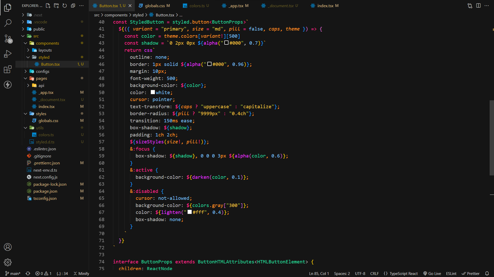

# Draco dark VS Code theme

## Install

1. Go to [VS Marketplace](https://marketplace.visualstudio.com/items?itemName=Draco.draco-dark).
2. Click on the "Install" button.
3. Choose Draco-dark theme in the editor.

To override this (or any other) theme in your personal config file, please follow the guide in the [color theme](https://code.visualstudio.com/api/extension-guides/color-theme) documentation. This is handy for small tweaks to the theme without having to fork and maintain your own theme.
